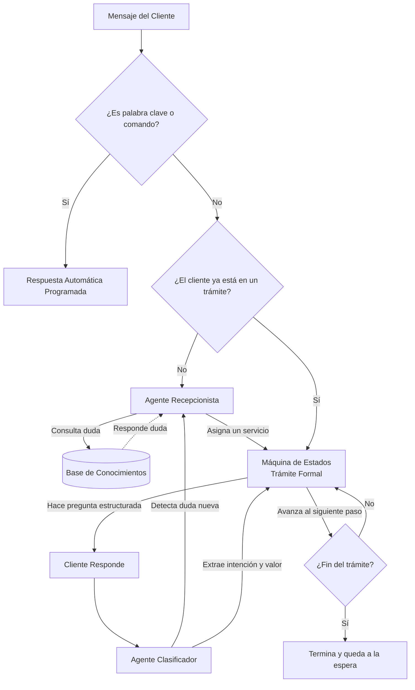

# Arquitectura de Atención de la Escuela de Manejo

Este documento explica de forma sencilla y a alto nivel cómo funciona el "cerebro" de nuestro asistente virtual. El sistema no es un solo bot gigante, sino un equipo de diferentes componentes (agentes y sistemas lógicos) que trabajan juntos para guiar al cliente.

## El Recorrido de un Mensaje

Cuando un cliente envía un mensaje por WhatsApp o Telegram, este es el viaje que realiza:

1. **La Primera Línea de Defensa (Filtros Rápidos):** 
   El sistema revisa si el cliente envió un comando especial (como `/d` para limpiar historial) o una **Palabra Clave** específica (como *"tareas"* o *"transporte"*). Si es así, el bot responde automáticamente con información pre-escrita y programada, sin gastar inteligencia artificial.

2. **Verificación de Flujos Activos:**
   Si el cliente no usó una palabra clave, el sistema revisa si el cliente ya está a la mitad de un trámite. Si es así, manda su mensaje directamente al **Clasificador** (explicado más abajo) para continuar el proceso.

3. **El Agente Recepcionista (Si es un cliente nuevo):**
   Si el cliente apenas nos está contactando, el mensaje llega al Agente Recepcionista, quien tiene la misión de entender qué necesita el cliente y canalizarlo correctamente.

---

## Los Agentes del Sistema (El Cerebro)

Nuestro asistente utiliza Inteligencia Artificial dividida en "agentes" con roles muy específicos:

### 1. El Agente Recepcionista (El Enrutador)
* **Su razón de existir:** Es la cara amigable del negocio. Su trabajo es conversar con el cliente nuevo, responder sus dudas iniciales y descubrir qué servicio necesita para enviarlo al departamento correcto (flujo).
* **Cómo funciona:** Analiza el mensaje crudo del cliente. Puede entender errores ortográficos o mensajes confusos.
* **Sus Herramientas:**
  * *Base de Conocimientos (RAG):* Si el cliente tiene dudas (ej. *"¿Cuánto cuesta el curso?"*, *"¿Tengo que llevar mi propio casco?"*), el recepcionista usa esta herramienta para buscar la información en nuestra base de datos, responder la duda y preguntar si desea continuar con el trámite.
  * *Canalizador de Flujos:* Tiene el poder de iniciar trámites oficiales ("GENERAL", "CLASES", "DICTAMEN", "ALQUILER", "QUEJA").

### 2. El Agente Clasificador (El Analista dentro del Trámite)
* **Su razón de existir:** Una vez que el cliente ya entró a un trámite oficial (ej. está agendando un alquiler), las preguntas que hace el bot son fijas (ej. *"¿Qué tipo de vehículo ocupas?"*). El trabajo del Clasificador es "traducir" lo que el humano responda para que el sistema informático lo entienda.
* **Cómo funciona:** Toma la respuesta del cliente y la evalúa contra la pregunta que el bot le acaba de hacer. 
* **Qué hace exactamente:**
  * Determina si el cliente afirmó, negó o rechazó el trámite.
  * Extrae datos clave. Por ejemplo, si el cliente escribe *"ocupo un sedán manual"*, el clasificador lo traduce al dato limpio: `carro`.
  * *Detector de Desvíos:* Si en medio del trámite el cliente hace una pregunta totalmente diferente, el clasificador lo nota y alerta al sistema para que primero se responda esa duda antes de seguir.
  * *Resumidor de Quejas:* Si el usuario se confunde mucho o pide ayuda humana, el clasificador redacta un pequeño resumen del problema para entregárselo a un asesor real.

---

## La Máquina de Estados (Los Trámites Formales)

A diferencia de los Agentes (que usan Inteligencia Artificial para pensar), la **Máquina de Estados** es el "rail" o camino estricto por el que camina el bot para asegurar que los trámites se hagan bien y en orden.

* **¿Qué es?** Es el sistema que dicta qué pregunta sigue. Lee un archivo pre-escrito (`mensajes.json`) donde están todos nuestros guiones de venta y pasos a seguir.
* **¿Cómo trabaja con la IA?** La Máquina de Estados le envía un texto fijo al cliente (ej. *"¿En qué sede te ubicas?"*). Luego se queda esperando. Cuando el cliente responde, la máquina no piensa, sino que le pide ayuda al **Agente Clasificador** para que le traduzca la respuesta. Una vez traducida, la Máquina de Estados avanza al siguiente paso del guion o termina el trámite.

### Resumen del Ecosistema
1. **Cliente escribe** ➡️ **Filtros rápidos** (Si aplica) ➡️ **Recepcionista** (Resuelve dudas y lo mete a un trámite).
2. **Dentro del Trámite** ➡️ La **Máquina de Estados** hace las preguntas y el **Clasificador** traduce las respuestas del cliente hasta llegar a la meta final.

### Diagrama de Flujo Visual

