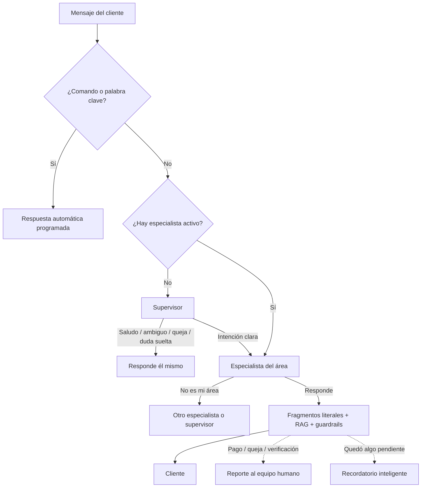

# Arquitectura de Atención de la Escuela de Manejo

Este documento explica de forma sencilla y a alto nivel cómo funciona el "cerebro" de
nuestro asistente virtual. No es un solo bot gigante: es un **equipo de agentes** (un
supervisor y varios especialistas) que trabajan juntos para guiar al cliente, más una
capa determinista que garantiza que los textos del negocio salgan siempre exactos.

Los detalles técnicos viven en `docs/modelo_unico.md`; el mapa completo de
especialistas, mensajes fijos y prompts en `docs/diseno_especialistas.md`.

## El Recorrido de un Mensaje

1. **Filtros rápidos (sin IA):** el sistema revisa si el cliente envió un comando
   especial (como `/d`) o una **palabra clave** del negocio (*"tareas"*,
   *"transporte"*). Si es así, responde con mensajes pre-escritos y programados, sin
   gastar inteligencia artificial. La publicidad y las bienvenidas a grupos también
   van por esta vía.

2. **El Supervisor (recepción):** si no hay un especialista atendiendo la
   conversación, el mensaje llega al supervisor. Él atiende saludos, mensajes
   ambiguos, quejas, felicitaciones por ganar la prueba y dudas informativas sueltas;
   y cuando detecta una intención clara de servicio, **enruta** la conversación al
   especialista del área.

3. **El Especialista (dueño de la conversación):** una vez enrutada, la conversación
   entra directo al especialista en los turnos siguientes (routing "pegajoso": una
   sola llamada al modelo por turno). Cada especialista conoce SOLO su área:

   | Especialista | Atiende |
   | --- | --- |
   | GENERAL | Intake del proceso de licencia (¿teórico ganado?, ¿cita?) |
   | CURSO_TEORICO | Matrícula del curso teórico por ciudad, cita teórica, enteros, reingreso |
   | ALQUILER | Alquiler de vehículo para la prueba de manejo (todas las categorías) |
   | CLASES | Clases prácticas de manejo |
   | DICTAMEN | Dictamen médico y su formulario |
   | TRAMITES | Renovación, homologación, permiso temporal, taxi, maquinaria, cancelaciones, multas |

   Si el tema no es suyo, el especialista **devuelve el turno** (`defer`) y el caso
   pasa al área correcta con el contexto ya reunido (nadie repregunta lo que el
   cliente ya dijo).

## Cómo se garantiza la precisión (capa determinista)

Los agentes deciden; el **código** hace cumplir las reglas duras:

- **Textos curados literales:** los precios, guiones y formularios viven por proyecto en
  Postgres y se editan en «Agente IA → Fragmentos» (`mensajes.json` es respaldo). El agente los referencia con etiquetas (`[[frag:ID]]`) y el
  sistema los expande al texto exacto — el modelo nunca los reescribe.
- **Partición por área:** cada agente solo puede enviar los fragmentos de SU
  catálogo; una etiqueta ajena se descarta automáticamente.
- **Base de conocimiento (RAG):** toda duda informativa (requisitos, costos,
  trámites) se responde con evidencia de la base; si no hay respaldo, el bot lo
  admite y la pregunta queda registrada para el equipo.
- **Guardrails:** anti-bucle (si el bot fuera a repetirse, deriva a un humano),
  anti ping-pong entre áreas, reportes al equipo humano con bloqueo cuando el caso
  pasa a gestión manual (pagos, quejas, verificaciones).
- **Recordatorios inteligentes:** si el cliente deja algo pendiente, un agente de
  seguimiento decide más tarde si conviene retomar y redacta UN mensaje al punto
  exacto donde quedó el chat (con topes duros de frecuencia en código).

## Diagrama de flujo

